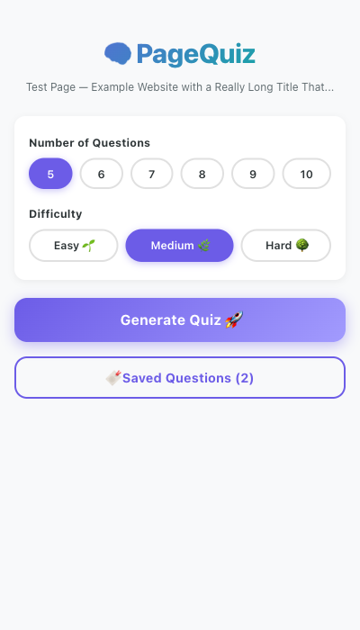
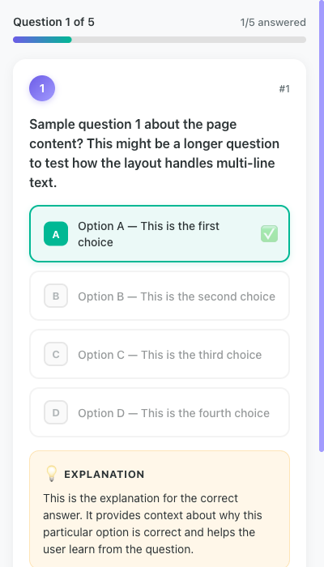
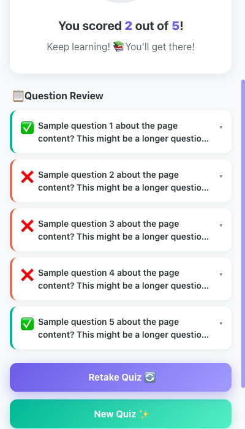
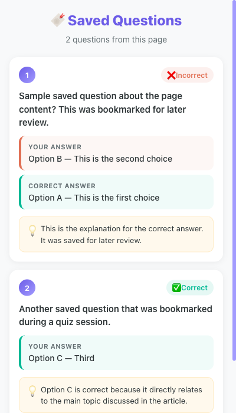
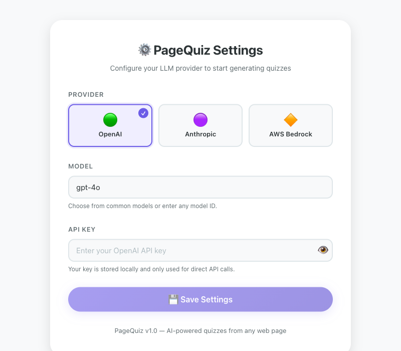

# 🧠 PageQuiz

**Generate AI-powered quizzes from any web page.** PageQuiz is a Chrome extension that reads the content of the page you're viewing and uses LLMs to create interactive multiple-choice quizzes — perfect for testing your understanding of articles, blog posts, documentation, and more.



## ✨ Features

- **AI-Powered Quiz Generation** — Extracts page content and generates 5–10 multiple-choice questions using your choice of LLM
- **Multiple LLM Providers** — Supports OpenAI, Anthropic, and AWS Bedrock (with custom model IDs)
- **Adjustable Difficulty** — Choose between Easy 🌱, Medium 🌿, and Hard 🌳
- **Instant Feedback** — See if you're right or wrong immediately after each answer, with detailed explanations
- **Save Questions** — Bookmark individual questions with 🔖 to revisit later
- **Review Saved Questions** — Load previously saved questions for any page you've visited
- **Score Summary** — Get a final score with a visual donut chart and confetti for high scores 🎉
- **Side Panel UI** — Stays open alongside the page so you can reference the content while quizzing

## 📸 Screenshots

### Quiz Screen
Answer questions one at a time with immediate feedback and explanations.



### Results Screen
See your final score with a visual breakdown of all questions.



### Saved Questions
Review bookmarked questions from previous quiz sessions.



### Options Page
Configure your LLM provider, model, and API key.



## 🚀 Setup

### Prerequisites

- [Node.js](https://nodejs.org/) (v18 or later)
- [Google Chrome](https://www.google.com/chrome/) (v116 or later, for side panel support)
- An API key for one of the supported LLM providers:
  - [OpenAI](https://platform.openai.com/api-keys)
  - [Anthropic](https://console.anthropic.com/)
  - [AWS Bedrock](https://aws.amazon.com/bedrock/) (bearer token)

### 1. Clone and Install

```sh
git clone <your-repo-url>
cd page-quiz
npm install
```

### 2. Build the Extension

```sh
npm run build
```

This creates a `dist/` folder with the built extension.

For development with auto-rebuild on file changes:

```sh
npm run dev
```

### 3. Load in Chrome

1. Open Chrome and navigate to `chrome://extensions`
2. Enable **Developer mode** (toggle in the top-right corner)
3. Click **"Load unpacked"**
4. Select the `dist/` folder inside the project directory
5. The PageQuiz icon will appear in your Chrome toolbar

### 4. Configure Your LLM Provider

1. Right-click the PageQuiz extension icon → **Options** (or click the gear icon on `chrome://extensions`)
2. Select your **Provider** (OpenAI, Anthropic, or AWS Bedrock)
3. Choose a **Model** from the suggestions or type any custom model ID
4. Enter your **API Key** (or AWS Bearer Token for Bedrock)
5. For Bedrock: enter your **AWS Region** (e.g., `us-east-1`)
6. Click **Save Settings**

> 🔒 Your API key is stored locally in Chrome's extension storage and is only used for direct API calls to your chosen provider. It is never sent anywhere else.

## 📖 How to Use

### Generating a Quiz

1. Navigate to any web page with readable content (articles, blog posts, documentation, etc.)
2. Click the **PageQuiz icon** in the toolbar — the side panel opens
3. Configure your quiz:
   - **Number of Questions**: 5–10
   - **Difficulty**: Easy, Medium, or Hard
4. Click **"Generate Quiz 🚀"**
5. Wait for the AI to generate your quiz (usually 5–15 seconds depending on the model)

### Taking the Quiz

1. Read each question and select your answer from the four options
2. Click **"Submit Answer ✓"** to lock in your choice
3. See immediate feedback:
   - ✅ Green = correct, ❌ Red = wrong
   - 💡 Explanation appears below
4. Optionally click **"Save Question 🔖"** to bookmark questions for later review
5. Navigate between questions with **← Previous** / **Next →** buttons
6. After answering all questions, click **"See Results 🎉"**

### Reviewing Results

- View your score as a percentage with a donut chart
- Scores ≥ 80% trigger confetti 🎊
- Expand any question to review answers and explanations
- **Retake Quiz** — same questions, fresh answers
- **New Quiz** — go back and generate different questions

### Saved Questions

- When you visit a page where you've previously saved questions, a **"🔖 Saved Questions"** button appears on the home screen
- Click it to review your bookmarked questions with your original answers, correct answers, and explanations

## 🏗️ Project Structure

```
page-quiz/
├── sidepanel.html              # Side panel entry point
├── options.html                # Options page entry point
├── vite.config.js              # Vite build configuration
├── package.json
├── public/
│   ├── manifest.json           # Chrome Extension Manifest V3
│   ├── service-worker.js       # Background: LLM calls, content extraction, storage
│   └── icons/                  # Extension icons
├── src/
│   ├── sidepanel/
│   │   ├── main.jsx            # React entry point
│   │   ├── App.jsx             # Main app with screen state management
│   │   ├── App.css             # Global styles & animations
│   │   └── components/
│   │       ├── HomeScreen.jsx      # Quiz configuration
│   │       ├── LoadingScreen.jsx   # Animated loading state
│   │       ├── QuizScreen.jsx      # Question display & interaction
│   │       ├── ResultsScreen.jsx   # Score summary & review
│   │       └── ReviewScreen.jsx    # Saved questions viewer
│   └── options/
│       ├── main.jsx            # React entry point
│       ├── Options.jsx         # LLM provider configuration
│       └── Options.css
└── docs/                       # README screenshots
```

## 🛠️ Tech Stack

| Layer | Technology |
|-------|-----------|
| Extension | Chrome Manifest V3 |
| UI Framework | React 18 |
| Build Tool | Vite |
| Content Extraction | Custom DOM extraction with noise removal |
| LLM Integration | OpenAI, Anthropic, AWS Bedrock APIs |
| Storage | `chrome.storage.local` |
| Confetti | `canvas-confetti` |

## 🐛 Troubleshooting

### "Could not extract content from this page"
- Some pages (like `chrome://` URLs or PDFs) cannot be accessed by extensions
- Try refreshing the page and clicking "Generate Quiz" again
- Single-page apps may need a moment to fully render before content can be extracted

### "No API key configured"
- Open extension Options (right-click icon → Options) and set up your LLM provider

### Quiz generation fails or returns bad JSON
- Try a different model — some models follow JSON instructions better than others
- `gpt-4o-mini`, `claude-sonnet-4-20250514`, and `claude-haiku-4-20250414` work well

### Extension doesn't appear after loading
- Make sure you selected the `dist/` folder (not the project root)
- Rebuild with `npm run build` if you've made changes

## 📄 License

MIT